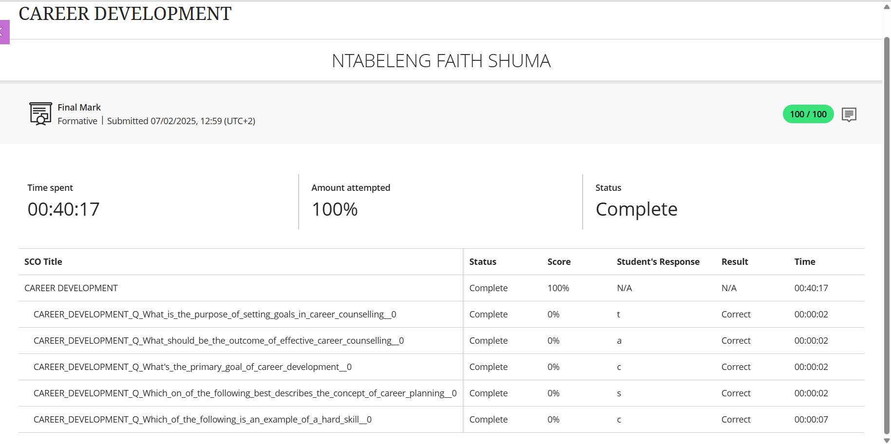
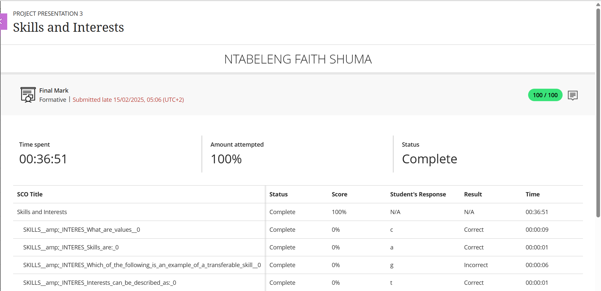
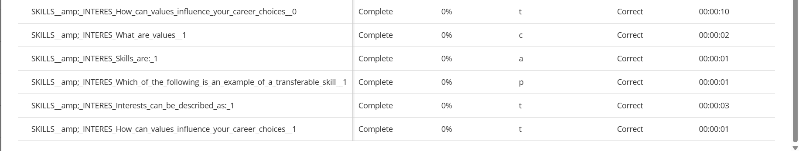
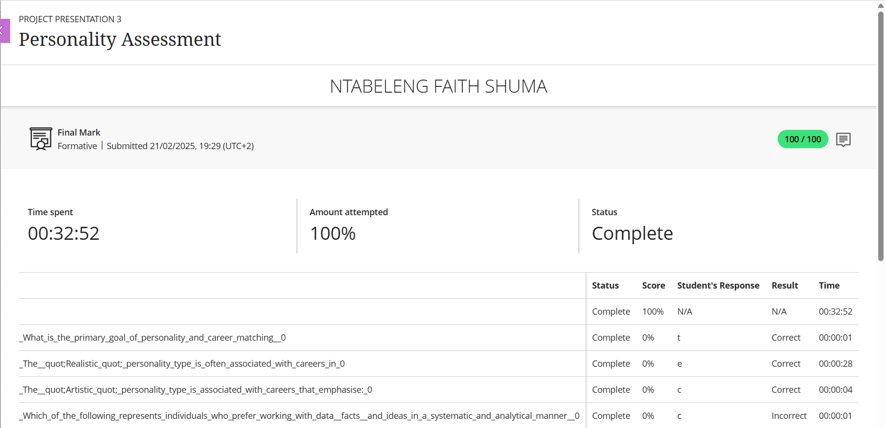
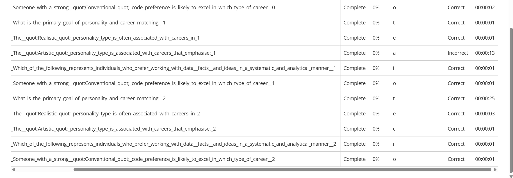
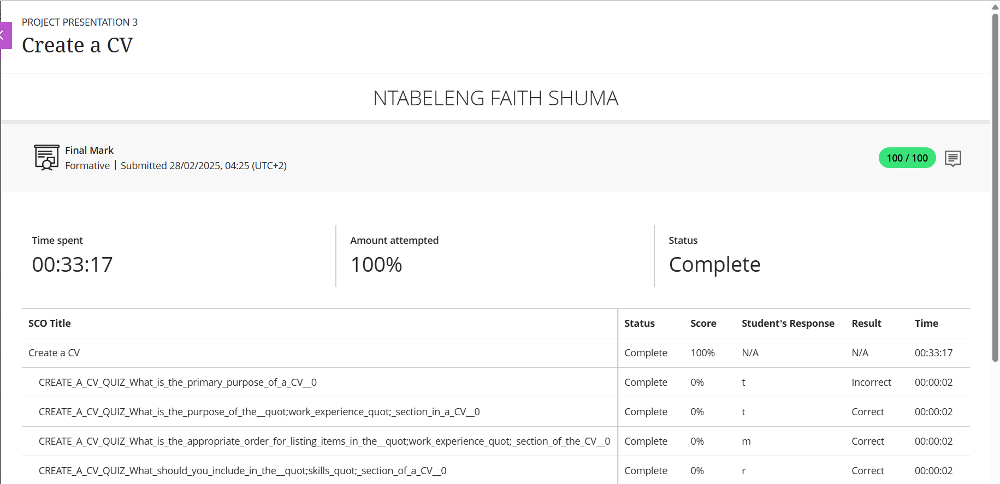
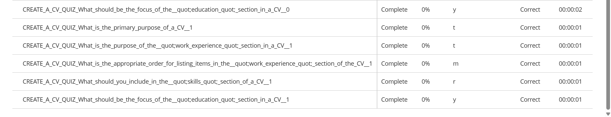
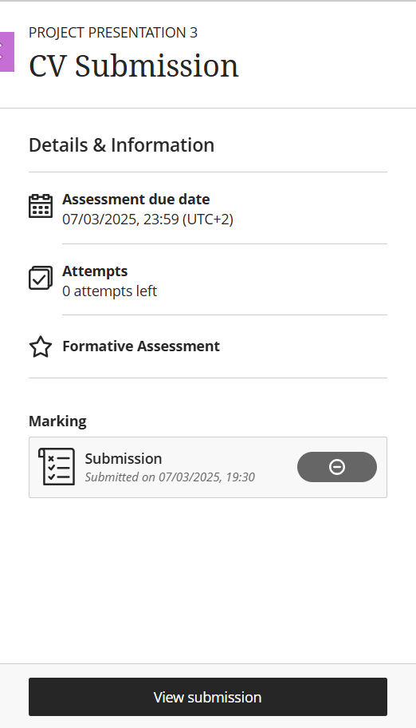

## Hi there

# GitHub Portfolio – Work Readiness Training

Welcome to my digital portfolio, where I share evidence and STAR reflections from my journey through the **Work Readiness Training Programme**.

---

## Career Counseling

### Evidence  

### STAR Reflection  
**S**ituation: At the start of the Work Readiness Programme, I was introduced to the concept of career counselling, which emphasized the importance of creating a structured career development plan.  
**T**ask: My goal was to reflect on my values, strengths, and long-term aspirations in order to create a SMART-based career plan that would guide me through the next few years of my professional life.  
**A**ction: I completed various self-assessment activities, including quizzes and journaling prompts, that helped me identify my core motivations—like a desire for meaningful work, stability, and personal growth. I clarified my three-year vision and then broke it down into SMART goals, using the strategies taught (e.g., ensuring each goal was measurable and time-bound). I also identified skill gaps and created an action plan to close them.  
**R**esult: This process helped me gain a clear sense of direction. I now have a career development plan that is realistic, actionable, and aligned with my values.

---

## Skills and Interests

### Evidence  
  

### STAR Reflection  
**S**ituation: I was often unsure why certain roles appealed to me more than others. The Skills and Interests module gave me a framework to understand my own preferences and natural talents.  
**T**ask: I had to reflect on what makes me feel prideful, fulfilled, and happy in order to define my core values, then identify transferable and adaptive skills I already possess.  
**A**ction: I used a structured process from the course that included values-mapping, identifying past achievements, and taking an interests quiz based on vocational profiles. I discovered that I value creativity, autonomy, and helping others. I also recognized that I have strong skills in planning, communication, and adaptability. I then matched these interests and strengths to potential careers using the provided career fit matrix.  
**R**esult: This reflection gave me clarity on the type of roles I’m likely to enjoy and excel in.

---

## Personality Assessment

### Evidence  
  

### STAR Reflection  
**S**ituation: I used to approach job applications without considering how my personality fits into certain work environments. This changed after the Personality Assessment module.  
**T**ask: The goal was to define my personality type, then connect it to suitable career paths and environments that would allow me to thrive.  
**A**ction: I completed the personality quiz, which revealed I’m mostly aligned with the Social, Enterprising, and Artistic types. I enjoy helping others, expressing creativity, and taking initiative. I reflected on how I interact in group settings and what type of work energizes me. Based on the personality-career matching guides, I explored roles in communications, creative industries, and leadership positions.  
**R**esult: I now know how to align my career choices with who I am, which will help me avoid burnout and increase job satisfaction.

---

## Create a CV

### Evidence  
  

### STAR Reflection  
**S**ituation: I previously had an outdated CV that didn’t highlight my skills or align with my career goals. Through this module, I learned that a CV should be a marketing tool, not just a list of jobs.  
**T**ask: I was tasked with designing a professional CV that included mandatory sections (like contact info, education, and work experience) and optional sections (like a personal statement or skills list), all tailored to a specific job role.  
**A**ction: I followed the format guidelines from the lesson, organizing my work experience in reverse chronological order and using action verbs in bullet points to describe achievements. I also crafted a short personal summary to highlight my strengths.  
**R**esult: I now have a clean, job-ready CV that represents me well and highlights my relevant experience.

---

## CV Submission

### Evidence  

### STAR Reflection  
**S**ituation: After finalizing my CV, the last step was to formally submit it—something that felt very real and a bit intimidating at first.  
**T**ask: I had to submit my CV professionally, ensuring that it was polished and ready for review.  
**A**ction: I proofread the document, tailored it to the role, and submitted it to the platform provided. I captured a screenshot to confirm my submission.  
**R**esult: Submitting my CV felt like a major milestone. It symbolized the culmination of my preparation and helped me feel confident about entering the job market.

---

Thank you for viewing my portfolio! 🙏 I hope it offers a clear reflection of my growth and readiness for the world of work.
